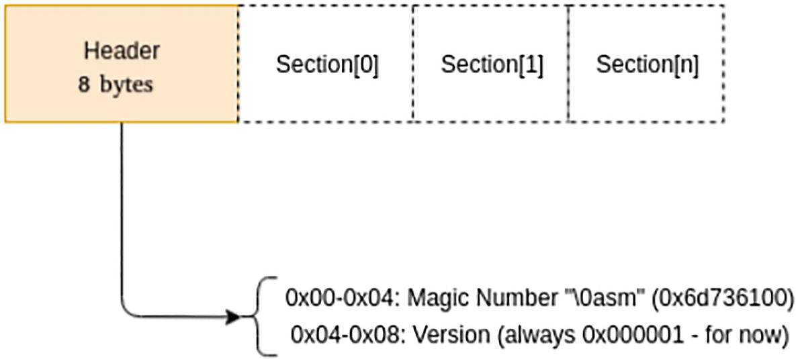

# WASM Header


- [https://learning.oreilly.com/library/view/webassembly-for-cloud/9781484274965/html/520626_1_En_2_Chapter.xhtml](https://learning.oreilly.com/library/view/webassembly-for-cloud/9781484274965/html/520626_1_En_2_Chapter.xhtml)

The WebAssembly header is an 8-byte filled with the magic number \0asm in ASCII.

It is followed by the version number, which is always 1.

The hex representation `\x00\x61\x73\x6d\x01\x00\x00\x00` represents the 0asm magic number and the version combined. This is needed to create a valid Wasm file.

On an Ubuntu machine, type the following command.

```
printf "\x00\x61\x73\x6d\x01\x00\x00\x00" > header.wasm
```

This creates a valid Wasm file called test.wasm, which any of the Wasm runtimes can load.

